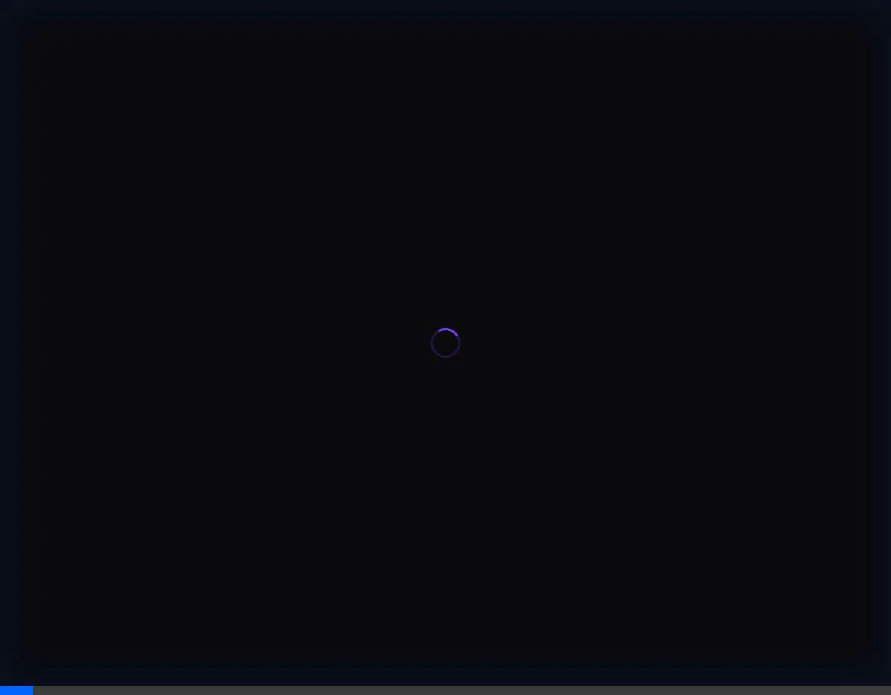
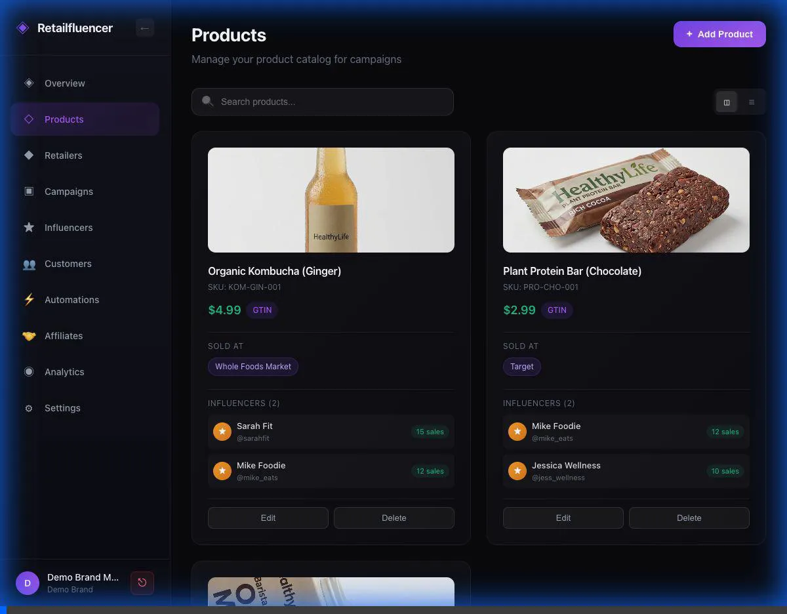
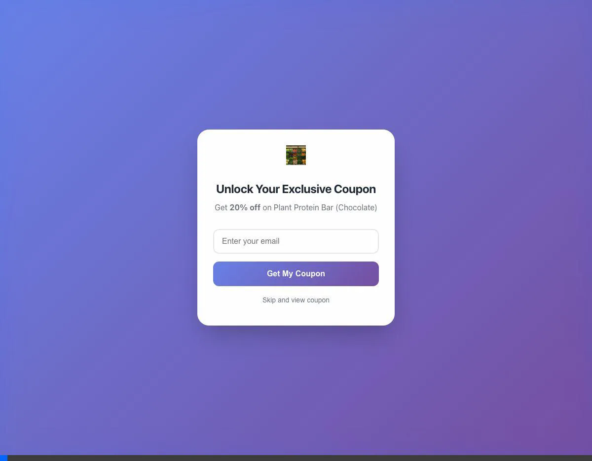
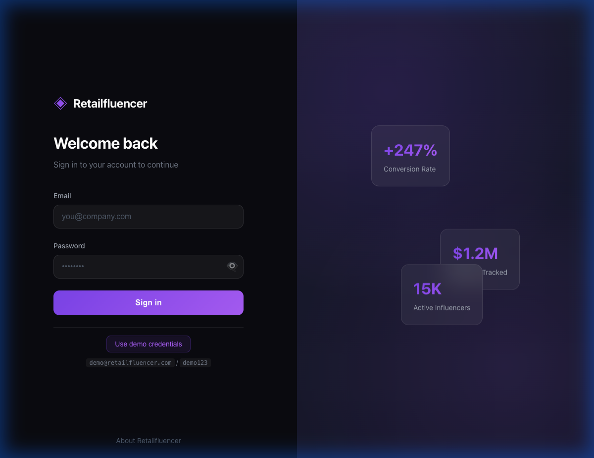
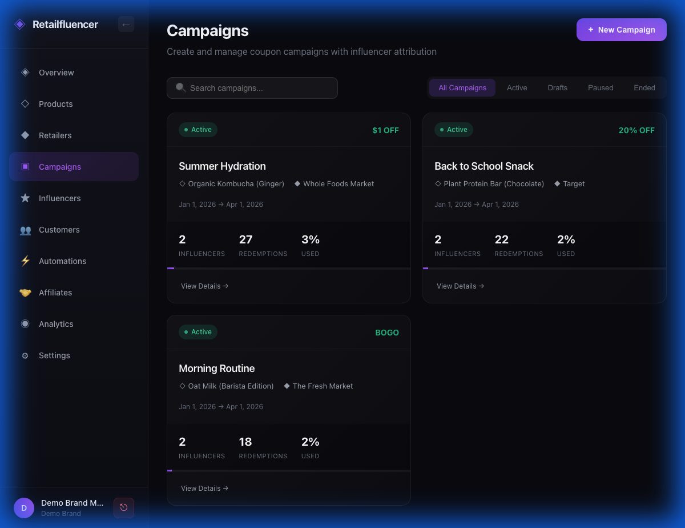
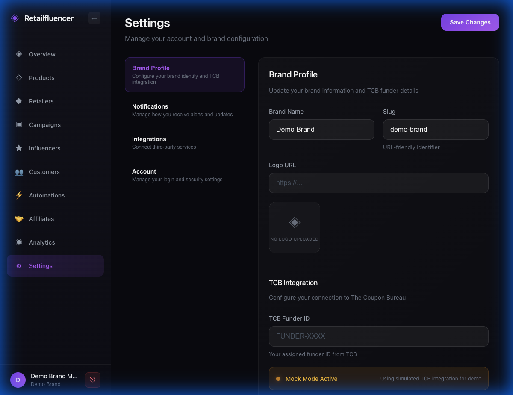
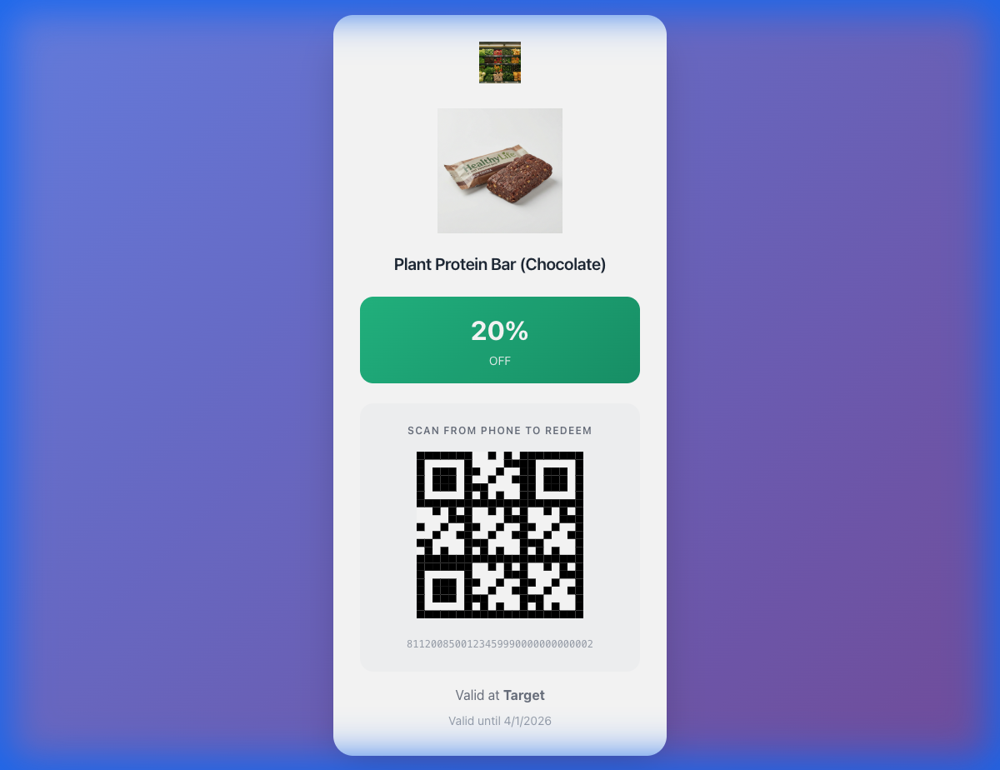

# Retailfluencer Demo Review
**For Stakeholder Review — January 2026**

---

## Executive Summary

Retailfluencer is a SaaS platform that enables **influencer-to-retail sales attribution** using 8112 universal digital coupons. This document provides a comprehensive walkthrough of the demo-ready platform for stakeholder review.

> [!IMPORTANT]
> **Demo Status: ✅ Ready for Presentation**
> All MVP features from the original proposal are implemented and functional.

---

## Platform Overview

### The Value Proposition
Retailfluencer bridges the gap between influencer marketing and physical retail sales. By leveraging the GS1 8112 standard, brands can:
- Issue **trackable, single-use coupons** to influencers
- **Attribute in-store sales** back to specific creators
- Convert customers into **affiliates** automatically (Snowball Effect)

---

## Demo Walkthrough Videos

### 🎬 Dashboard & Analytics Flow


### 🎬 Products & Retailers Management


### 🎬 Campaign Builder (5-Step Wizard)


### 🎬 Automations & Settings


### 🎬 Public-Facing Pages


---

## Feature Screenshots

### Login Experience
Professional login with trust indicators ($1.2M Revenue, 15K Influencers) and demo credentials shortcut.



---

### Campaigns Dashboard
Active campaigns with status, product, retailer, and performance metrics.



---

### Campaign Builder Wizard
5-step wizard: Basics → Product & Retailer → Discount → Influencers → Review

````carousel

<!-- slide -->

````

---

### Automations Engine
Node-based workflow builder with triggers (New Customer, Coupon Redeemed) and actions (Email, SMS, Create Affiliate, Wait).

````carousel

<!-- slide -->

````

---

### Settings & Brand Profile
Brand configuration with TCB (The Coupon Bureau) integration. "Mock Mode Active" badge for demo.



---

### Public Coupon Page
Customer-facing coupon with email capture gate, QR code, and 8112 serial number.

````carousel

<!-- slide -->

````

---

### Affiliate Referral Landing
Personalized landing page for influencer promotions with share functionality.


---

### About / Product Story
Investor-ready page explaining the platform's "Snowball Effect" and true attribution value.


---

## Feature Checklist vs Proposal

| Proposal Feature | Status | Notes |
|-----------------|--------|-------|
| Dashboard with metrics | ✅ Done | 82 Redemptions, $366.68 Revenue |
| Products CRUD | ✅ Done | 3 products with images, SKU, COGS |
| Retailers with 8112 flags | ✅ Done | 6 retailers, all 8112 enabled |
| Campaign Builder | ✅ Done | Full 5-step wizard |
| Influencer CRM | ✅ Done | 4 influencers with performance data |
| Affiliate System | ✅ Done | Referral codes, commissions |
| Customer CRM | ✅ Done | List + detail view with timeline |
| Automations | ✅ Done | Email, SMS, Wait, Create Affiliate |
| Coupon Pages | ✅ Done | QR code + email capture |
| Analytics Charts | ✅ Done | Redemption trends, top performers |
| Settings | ✅ Done | Brand profile, TCB config |

---

## Known Issues

| Issue | Severity | Status |
|-------|----------|--------|
| "Invalid Date" in Customers table | Minor | To Fix |

---

## Recommended Demo Flow

1. **Login** → Show demo credentials, trust metrics
2. **Dashboard** → Highlight key performance indicators
3. **Products** → CPG catalog with margin tracking
4. **Campaigns** → Walk through 5-step builder
5. **Coupon Page** → Show public `/c/[gs1]` with QR
6. **Automations** → Demonstrate "Snowball" workflow
7. **Affiliates** → Show converted customers
8. **About** → Close with investor pitch

---

## Next Steps

### Before Demo
- [ ] Fix "Invalid Date" bug in customer data

### Future Enhancements (Phase 2)
- Revenue by Product chart
- Snowball Growth visualization
- Social content scraping
- Real TCB API integration

---

**Prepared by:** Retailfluencer Development Team  
**Date:** January 1, 2026
